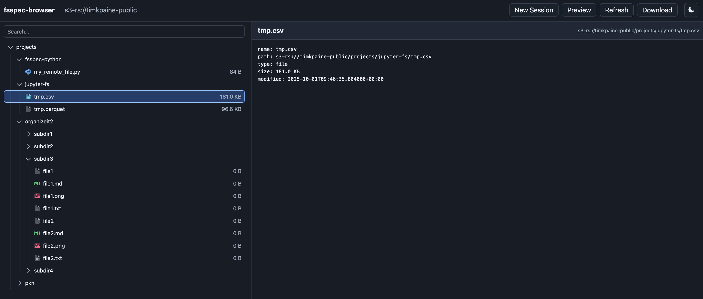
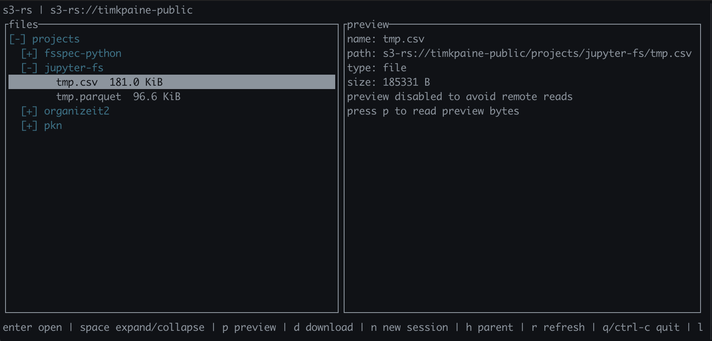

# fsspec-browser

Terminal and web browser for fsspec-backed filesystems.

[](https://github.com/1kbgz/fsspec-browser/actions/workflows/build.yaml)
[](https://codecov.io/gh/1kbgz/fsspec-browser)
[](https://github.com/1kbgz/fsspec-browser)
[](https://pypi.python.org/pypi/fsspec-browser)

## Overview

`fsspec-browser` lets you inspect local files, object stores, and other fsspec-compatible filesystems from a terminal UI or a local web UI. It is built for browsing, previewing, and downloading files without writing one-off scripts.





## Install

```bash
pip install fsspec-browser
```

Install any fsspec backend packages your URLs require, such as S3, GCS, SSH, or cloud vendor integrations.

## Terminal Browser

```bash
fsspec-browser /tmp
fsspec-browser s3-rs://my-bucket/path -o endpoint_url=https://...
```

Use arrow keys or `j`/`k` to move, `Enter` to open directories, `p` to preview remote files, and `d` to download the selected file.

## Web Browser

```bash
fsspec-browser-web /tmp --host 127.0.0.1 --port 8765
fsspec-browser-web --host 127.0.0.1 --port 8765
```

When started without a path, the web UI opens a connection form. File previews are explicit and bounded by `--preview-bytes`.

## Documentation

See the full docs for terminal usage, web usage, and Python API reference.
